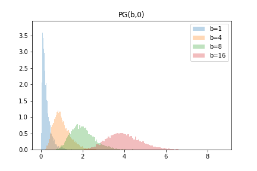
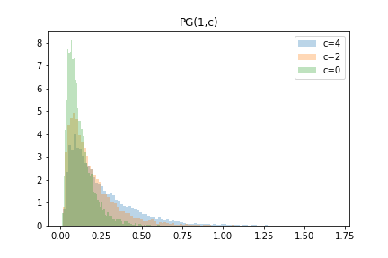

# polya-gamma
 

[Apache Commons Math3](https://commons.apache.org/proper/commons-math/) compatible Polya-Gamma distribution sampler implementation in Java.

## Depends on
- commons-math3 v3.6.1

## Example 
```java
// use default sampler
PolyaGammaDistribution pg1 = new PolyaGammaDistribution(2, 4);
double x1 = pg1.sample(); 

// select sampler explicitly
PolyaGammaDistribution pg2 = new PolyaGammaDistribution(2, 4, PolyaGammaDistribution.AvailableSampler.Devroye);
double x2 = pg2.sample();
```

## Samplers
- Wrapper (default)
- Devroye approx
- Gaussian approx
- Saddle Point approx (WIP)

## refs
- Polson, Nicholas G., James G. Scott, and Jesse Windle. "Bayesian inference for logistic models using Pólya–Gamma latent variables." Journal of the American statistical Association (2013)
- J. Windle, N. G. Polson, and J. G. Scott. "Improved Polya-gamma sampling". Technical Report, University of Texas at Austin (2013)
